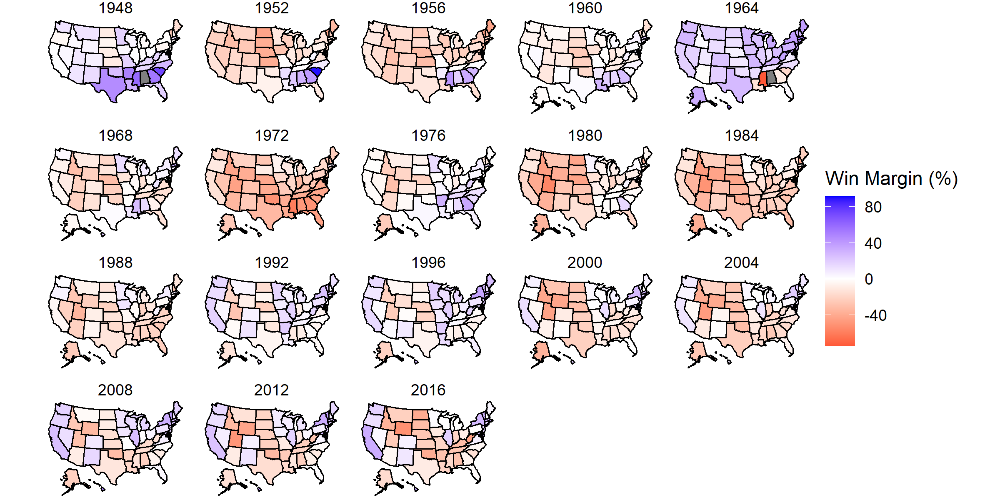
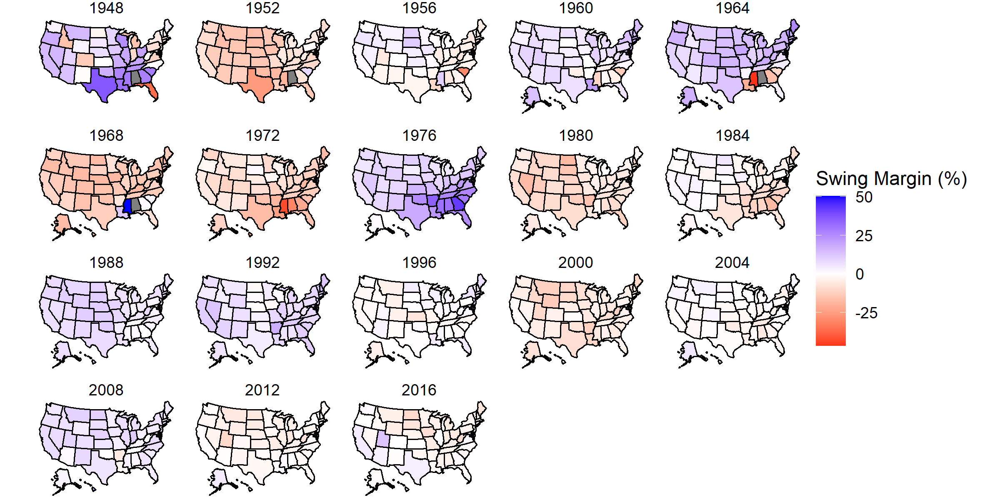

# Introduction

# September 12, 2020

## Past Presidential Election Results: A Prelude to Prediction

We begin with past presidential election results to try to understand historical
voting trends at a holistic level. Looking at elections from 1948 to 2012, we
can see a couple of immediate trends.

### Presidential Two-Party Popular Vote Shares in U.S. Elections 1948-2016

- **No state is immune to change.** Whether it is due to various migration
movements, ideological shifts, booming or busting economies, all states have
voted for both parties over this 68-year history. That said,
- **Change is slowing down.** It behooves the nation as a whole to have an open
mind about competing policies, but the data show that many states are ossifying,
generally finding a preference for Democrats on coastal states and Republicans
in the South and Midwest. This is the marker of modern elections: the "settling"
of the political landscape.

And so the natural question that arises is which states are still capable of
changing their mind? Where are the swing states, and what does that even mean?

## Swing States

So what exactly are "swing states"?

Looking at the graph above, we would expect according to the common definition
that swing states would have an absolute win margin near 0. There is a healthy
mix of Democrats and Republicans, which cancel each other out at the polls.
However, I wish to entertain a nuance found by comparing that common definition
to another graph.

### Percent Change in Vote Shares between U.S. Elections 1952-2016

In a sense, one could consider this graph, which measures the _change_ in how a
state votes from election year to election year, to be the derivative of the
first graph, and thus an actual measure of "swing." Consider what the scales of
each graph entail, particularly at absolute values near 0. Swing margins near 0
imply that states changed their voting behavior little or not at all.
Conversely, the more saturation a state has, the more fluid its voting behavior
can be. This is a direct demonstration of the "baked-in" nature of recent
election behavior that was discussed in the first graph.

So what, then, is the difference between the whitespace of both graphs?

I would argue that where the swing map is a better representation of
_polarization_, the win map is a better representation of _electoral closeness_,
however both I believe to be a form of identifying swing states. In the mid- to
late-twentieth century, swing margins were much higher, suggesting a foregone
ability to be swayed and ideologically fluid. Where we see the swing map lose
color, so too do we see our elections gain hyperpolarization; the chances of a
candidate "flipping states" become more and more slim; the concept of the
independent, rational voter becomes more and more a myth.

## Battleground State I.D.

- Historical / Colloquial Battleground States: Colorado, Florida, Iowa,
Michigan, Minnesota, Nevada, New Hampshire, North Carolina, Ohio, Pennsylvania,
Virginia, and Wisconsin

- Battleground States Predicted by Win Graph (close): Arizona, Florida,
Michigan, Minnesota, Nevada, Wisconsin

- Battleground States Predicted by Swing Graph (non-polarized): Iowa, Nevada,
North Dakota, Texas, West Virginia

## **_Funny Stuff_**

- Thank you, Dixiecrats and George Wallace, for screwing up my dataset.
- ~~Which states still swing like a couple in the 1930s?~~
- Please ignore the 1948 swing map; it is off doing its own thing (2016 data
from one state rolled over to give a value to 1948 of the next state).
