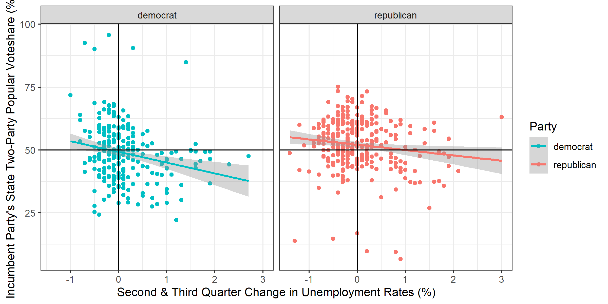
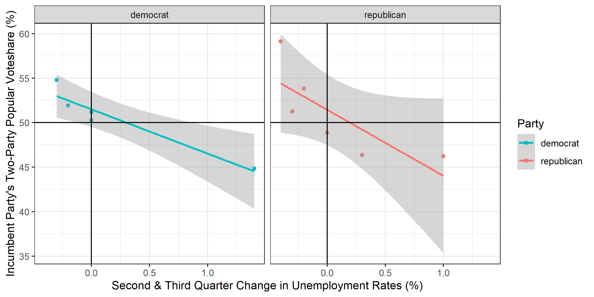

# Economics

# September 19, 2020

## The Economy: The Litmus Test of the Retrospective Voter

While the economy is often hailed in election analytics as one of the most
powerful variables in predicting voting behavior, it is almost equally vague as
a descriptive tool. Indeed, national economic data is the aggregation of
hundreds of millions of economic choices, made by individuals, firms, and
governments alike. Not only that, but it is also unclear what aspects of
the economy voters look to when making their decision: is it their own welfare,
or society's? Is it bird's-eye, aggregate data and reports, or an intuitive
gauge of the world around them?

## Local Unemployment

I will make the assumption for the following analysis that voters follow from
partial economic information, and are slightly sociotropic, meaning that they
most likely place emphasis on themselves and their surrounding communities.
This informed my decision in using state (representing local) unemployment data
in quarters 2 and 3 (representing partial) of election years from 1976 onward.
Additionally, I looked at the _relative_ change in unemployment between quarters
as people are more likely to view changes over holistic levels.

### Incumbent Party State Vote Vs. Rate Change in Unemployment 1976 - 2016

There is a slightly positive correlation coefficient of -0.18, but running a
linear regression over all state two-party popular votes reveals that
*Democratic incumbent presidents have historically taken more blame for changes*
*in the unemployment rate than Republican incumbent presidents.* 

## National Unemployment

Things get interesting when comparing this to national aggregate changes
in unemployment.

### Incumbent Party National Vote Vs. Rate Change in Unemployment 1976 - 2016

The data, at least ostensibly, support my initial hypothesis of voters being
less sociotropic than may be given credit to the "fully rational voter," as the
local unemployment data has a t-value nearly double that of the national
aggregation (111 compared to 65 for the intercepts). Additionally, the local
data has a multiple R-squared value of 0.03.

## Prediction

Following from the increased predictive power of the local data, I plugged in
the delta unemployment change from Q1 to Q2 (as Q3 data is currently not yet
available) into the regression and "predict" that Donald Trump will win 21.2% of
the popular vote. Granted, given the volatility of the economy this year, this
prediction most likely will not hold. But in the future, I would like to
account for more economic variables alongside unemployment and analyze the data
further to find a better correlation value (changes in RDI, for instance).
