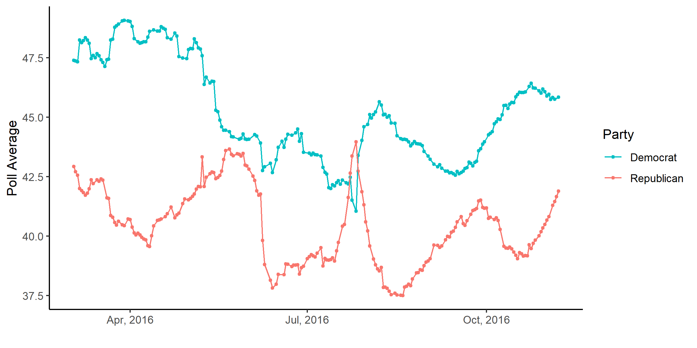

# Introduction

# September 12, 2020

## Polling: A Counterbalance to Fundamentals Forecasting

Given the dismal performance of last week's fundamentals-only forecast, it is
clear that, for this election, we will need something to compensate for such an
outlier of an economy. Enter professional polling. It serves as a snapshot public
opinion, and some pollsters are more renowned than others. That said, I wish to
dedicate this blog post to the difficulties of weighting, and the methods that
famous forecasters like FiveThirtyEight and The Economist use to comprehensively
evaluate and utilize the plethora of polls and the wisdom of the masses.

## Why Is Weighting Necessary?

Consider the following graph:

### Poll Averages in the 2016 U.S. Presidential Election

This graph shows the change in the average polling support for Hillary Clinton
and Donald Trump over the course of the election. While taking the average of
polls is industry standard, so as to *naturally* cancel out marginal errors
between polls, these averages have a flaw that is worth devoting serious
attention to: they treat every poll equally in the average. This ignores
systematic errors relating to consistent methodological and/or house biases,
like the mode of surveying, the sampling frame, and the sample size.

### 2016 Pollster Grade Distributions

Meow

### 2020 Pollster Grade Distributions

Meow

## Predictions

I have an intuitive apprehension for relying too much on fundamentals data this
election cycle, so for the time being I will be refraining from a "polls plus"
model, and will instead focus on maximizing efficiency in non-fundamentals areas.
That said, I will employing 

As I hope to have shown, weighting polls is very difficult, and where I have fallen
short in my efforts to create a successful weighting paradigm, I have learned
for my endeavors in future weeks.

## **_Funny Stuff_**

- Meow
