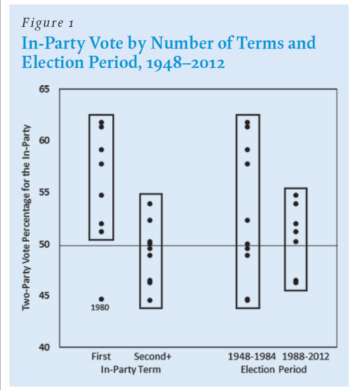

# Incumbency

# October 3, 2020


## Incumbency: A Diminishing Marginal Benefit


### "Forecasting the 2016 American National Elections" (Campbell 2016)




The more I look at this graph, the more I am irrevocably convinced that the
decay of the benefits of incumbency must be accounted for in our models.

1. Is Trump benefiting from an incumbency advantage? The short answer is most
likely yes, but that effect is being *offset* and *obfuscated* by everything
else extraordinary happening this year. "Indeed, roughly 1 year into the new
administration, Trump’s approval rating is much lower than would be expected
based on economic performance." [(Donovan et al)](https://doi.org/10.1007/s11109-019-09539-8).
Fundamentals seemed already to be less than apt for the Trump Administration,
but 2020 has introduced countless confounding variables in the form of federal
economic intervention and increased partisan polarization (the fall of the independent voter).

[Brown]( https://doi.org/10.1017/xps.2014.6) showed that what we think of as the
benefits of incumbency come in the form of *structural* advantages. So with the
fundamentals in such disarray, President Trump may enjoy less of an incumbency
boost than his predecessors.


2. This brings me to my second question: how does my polls-only model compare to
Abramawitz's "time for change" model? It is a renowned model known for having an
[extremely low out-of-sample error of 1.7% since 1992.](https://pollyvote.com/en/components/models/retrospective/fundamentals-plus-models/time-for-change-model/)
It is based on a multivariate regression of only three variables: 2nd-quarter GDP
growth; late-June / early-July approval ratings; and incumbency status.


## Time for Change in the Time for Change Model

Interestingly enough, [Abramawitz himself updated his "time for change" model for 2020. ](https://centerforpolitics.org/crystalball/articles/its-the-pandemic-stupid-a-simplified-model-for-forecasting-the-2020-presidential-election/) But seeing as most of his analysis can be found there using his simplified
model, I decided to use his traditional three-variable model to predict the 2020
election and compare to the polls-only model, as it is the one with the lowest
MSE.


### (Traditional) Time for Change Model Results

```r
Call:
lm(formula = pv2p ~ GDP_growth_qt + net_approve + incumbent, 
    data = time_chg)

Residuals:
    Min      1Q  Median      3Q     Max 
-4.1481 -1.1348 -0.0782  1.5210  3.9414 

Coefficients:
              Estimate Std. Error t value Pr(>|t|)    
(Intercept)   48.20356    1.05610  45.643  < 2e-16 ***
GDP_growth_qt  1.82267    0.62432   2.919 0.011203 *  
net_approve    0.12899    0.02453   5.259 0.000121 ***
incumbentTRUE  2.41125    1.23201   1.957 0.070571 .  
---
Signif. codes:  0 ‘***’ 0.001 ‘**’ 0.01 ‘*’ 0.05 ‘.’ 0.1 ‘ ’ 1

Residual standard error: 2.479 on 14 degrees of freedom
Multiple R-squared:  0.8177,	Adjusted R-squared:  0.7787 
F-statistic: 20.94 on 3 and 14 DF,  p-value: 1.924e-05
```

We can see highly statistically significant results...


### (Incumbent) Polls-Only Model Results

```r
Call:
lm(formula = pv ~ avg_support, data = omega_poll_inc)

Residuals:
     Min       1Q   Median       3Q      Max 
-3.06691 -0.69718  0.07827  1.04980  2.18929 

Coefficients:
            Estimate Std. Error t value Pr(>|t|)    
(Intercept)  8.22420    3.11503    2.64   0.0247 *  
avg_support  0.87532    0.06599   13.27 1.13e-07 ***
---
Signif. codes:  0 ‘***’ 0.001 ‘**’ 0.01 ‘*’ 0.05 ‘.’ 0.1 ‘ ’ 1

Residual standard error: 1.597 on 10 degrees of freedom
Multiple R-squared:  0.9462,	Adjusted R-squared:  0.9408 
F-statistic:   176 on 1 and 10 DF,  p-value: 1.132e-07
```


Until we compare it with this. With an adjusted R-squared value of 0.94 and
statistical significance, we can see that a polls-only model is still the one to
beat in this election cycle.


## **_Funny Stuff_**

- None for this post :/ (I promise to be funnier next week)
- Hah but what about that debate though?
