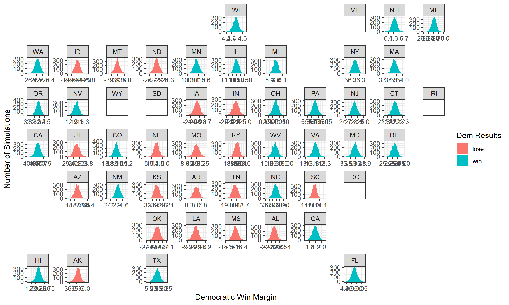

# Air War

# October 10, 2020

## The Air War: 

Though this week is about the "air war," fought between dueling presidential
campaigns in TV, radio, and digital ads, I focused more on working on a
state-level probabilistic model based on binomial regression-based simulations.
That said, I first would like to make a few comments on what is widely
considered one of the best campaigns run in modern politics: the 2008 Obama
campaign.

### Campaign Ads Aired By Issue and Party: 2008

- **Ads play along issues salient along the party line.**

## Prediction

The meat and potatoes of my effort, however, went into making a state-level
probabilistic model. It is a binomial regression, using polling averages five
weeks out from the election, both for the 2020 prediction and the data the model
ran on. **Going forward, I will not be including ad data in my predictions.**
The reason for this is that the data provided is very sparse--we can only go back 4 elections--
and given that ads have a limited affect (at least non-cumulatively), I will be
sticking with my polls-only model.

### 2020 Predicted Democratic State-Win Margins: 10,000 Simulations

I used geofacet to create a map of the distributions, and colored each individual
simulation by whether Biden won or lost that state. A damning result to this version
of my model is that *every state will always vote for one candidate.* The spread
does not allow for a state to swing between candidates, which is crucial for determining
a probability accordant with reality. Nevertheless, I took the liberty of calculating the
electoral votes for Biden in these 10000 scenarios (accounting for missing data) and
found that he will win 396 electoral votes.
