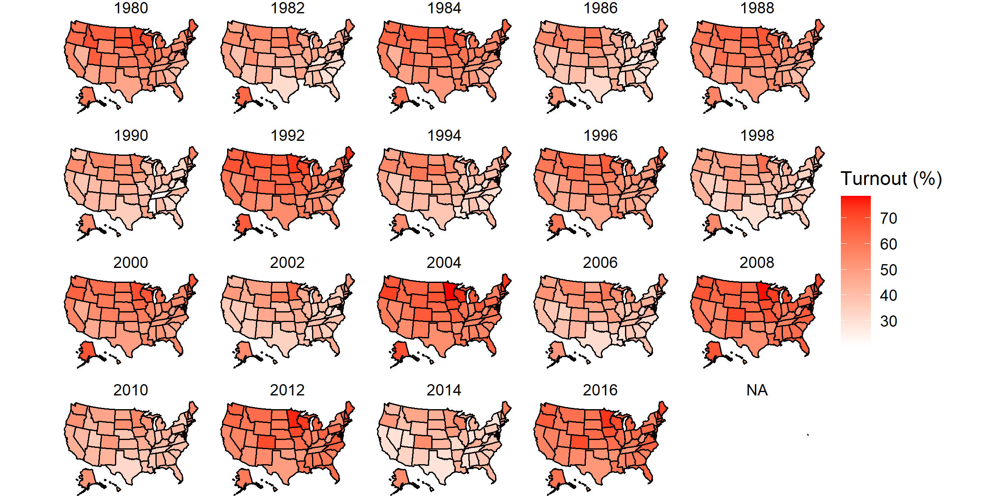
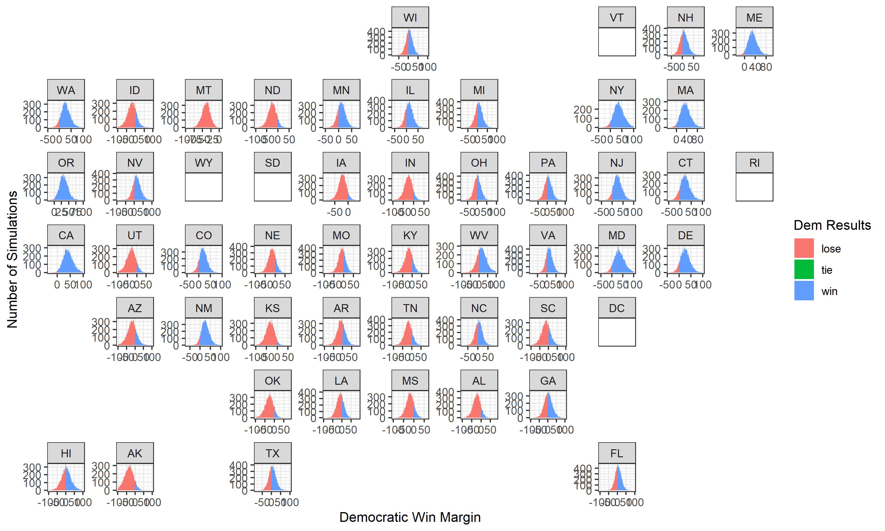

# Ground Game

# October 17, 2020

## The Ground Game: A Move to Mobilize

It is not enough for a presidential campaign to dominate the air war; it must
also win the ground game for a chance at total victory. That said, like last week,
I devoted significantly more time to updating my binomial regression-based simulations.
That said, I would like first to discuss two interesting points from [Darr and Levendusky.](https://journals-sagepub-com.ezp-prod1.hul.harvard.edu/doi/full/10.1177/1532673X13500520) The
first is that 2004 represented a "sea change" in how campaigns organized in-person contact
operations, so data prior to 2004 may not be so informative to modern election analytics.
The second is that a campaign's ground game, in the form of field offices, serves not so much
to *persuade* swing voters as to *mobilize* core supporters.

While campaign data are descriptively rich, they are still, to me, predictively nascent,
as we only have single-digit sample sizes from which to draw. Nevertheless, these
fascinating issues of **mobilization** and **turnout** inform my updated simulations.

### Voter Turnout in Presidential U.S. Elections 1980-2016

- **Midterms are, consistent with common knowledge, less mobilized than**
**presidential election years.** So it is a fault of my analysis, then, that I
included these categorically different turnout numbers in my calculations for
the binomial regression-based simulations. I hope to fix this in a later post.

## Prediction

Both [FiveThirtyEight](https://fivethirtyeight.com/features/how-fivethirtyeights-2020-presidential-forecast-works-and-whats-different-because-of-covid-19/)
and [The Economist](https://projects.economist.com/us-2020-forecast/president/how-this-works)
have attempted to account for the unpredictability introduced to the election by 
things like COVID-19 and voting by mail. I believe Nate Silver's holistic approach
is laudable, given how many ripple effects he accounts for in his adjustments; his
inclusion of news headlines, however, is less so due to the increased volume of important news
over time for big newspapers. The Economist only adjusts economic data in a conservative
way, which helps the model but will not fully capture the possible ramifications of COVID-19.

### New-and-Improved 2020 Predicted Democratic State-Win Margins: 10,000 Simulations

And we have variance!

## **_Funny Stuff_**

- There was a singular "tie" outcome that haunted my simulations and messed up
the color scheme. Not only that, but it *jumped between states as hosts.* Spooky.
