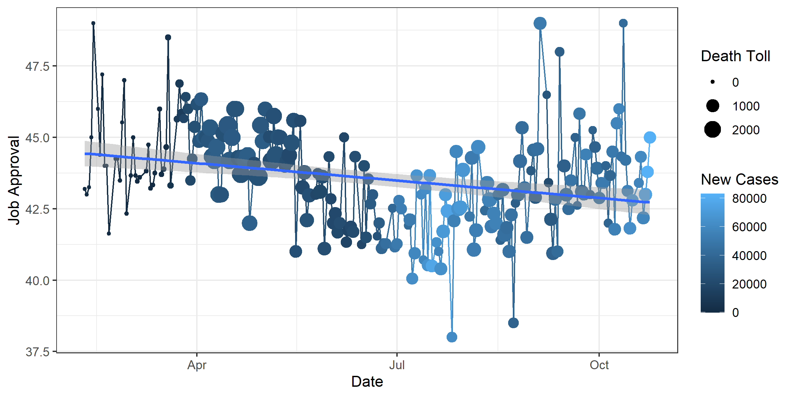
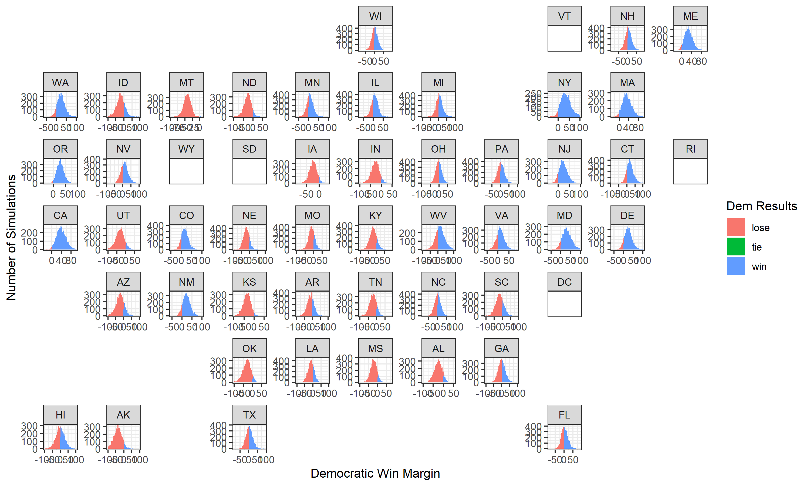
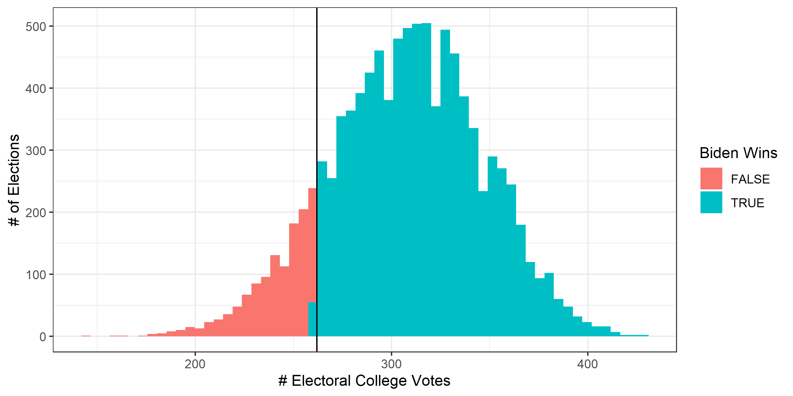

# Shocks

# October 24, 2020


## Shocks: Should We Account for the Unpredictable?


The


### Job Approval by Date, Death Toll, and New Cases




The


### Summary of Multivariate Regression: Job Approval by Death Toll & New Cases

```r
Call:
lm(formula = yes ~ death + positive, data = covid_app)

Residuals:
    Min      1Q  Median      3Q     Max 
-5.1435 -1.1037 -0.0211  0.9292  5.7631 

Coefficients:
              Estimate Std. Error t value Pr(>|t|)    
(Intercept)  4.491e+01  2.013e-01 223.106  < 2e-16 ***
death       -3.877e-05  5.356e-06  -7.239 7.75e-12 ***
positive     8.578e-07  1.429e-07   6.002 8.11e-09 ***
---
Signif. codes:  0 ‘***’ 0.001 ‘**’ 0.01 ‘*’ 0.05 ‘.’ 0.1 ‘ ’ 1

Residual standard error: 1.543 on 217 degrees of freedom
Multiple R-squared:  0.2325,	Adjusted R-squared:  0.2254 
F-statistic: 32.86 on 2 and 217 DF,  p-value: 3.408e-13
```


The


## Predictions


The


### 




The


### TITLE




## **_Funny Stuff_**


- The


## Data


[COVID Cases / Deaths](https://covidtracking.com/data)
[Job Approval (Thank you Yao!)](https://projects.fivethirtyeight.com/polls-page/president_approval_polls.csv)
[Presidential Polling Averages](https://projects.fivethirtyeight.com/polls/president-general/national/)
