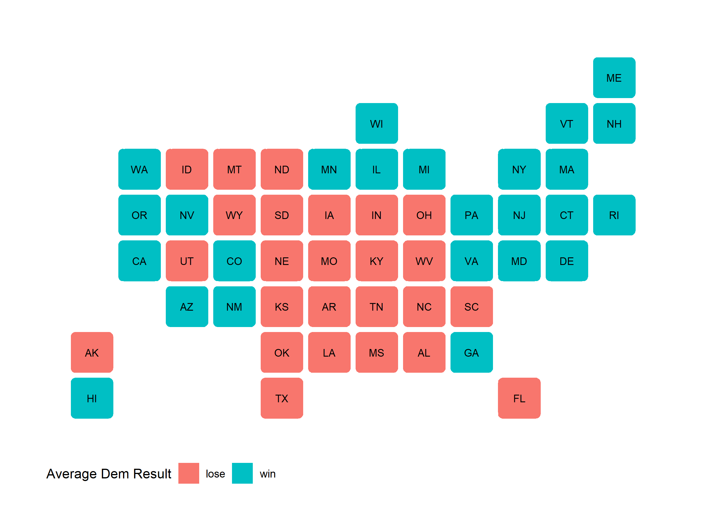
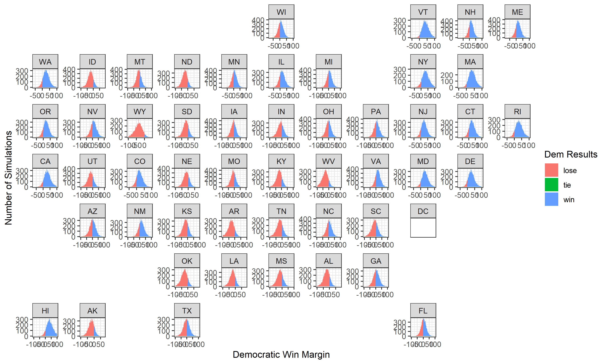
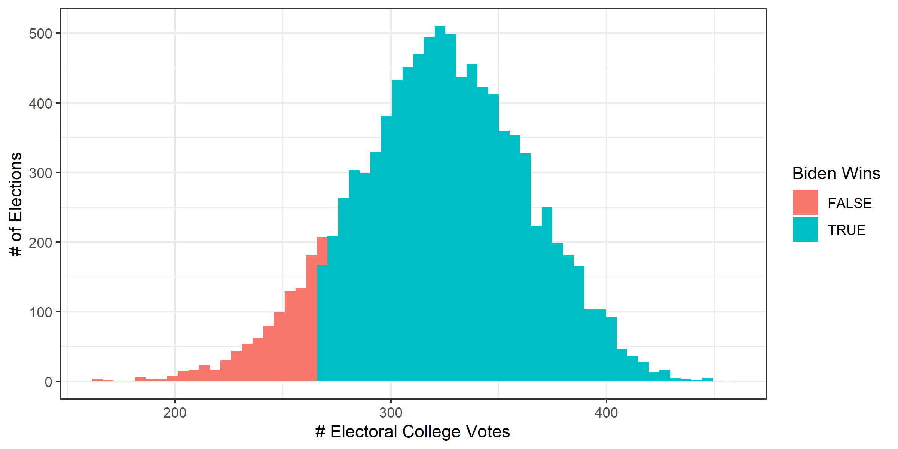

# Final Prediction

# November 1, 2020

## The Time for Uncertainty

I will try to keep this short and to the point.

#### Predicted Electoral Vote share: Biden **353**, Trump **185**.

### Average Simulated Election: State Results

## Model Formula

The

- ****

## Data Sources

Soubhik Barari & Sun Young Park (Gov 1347 TAs):

- VEP data for 1980-2016 elections
- Turnout data for 1980-2016 elections
- State popular vote share data for 1948-2016 elections
- State poll averages for 1968-2016 elections

Nate Silver (Founder, Head Analyst of FiveThirtyEight):

- [State poll averages for 2020 election](https://projects.fivethirtyeight.com/polls/president-general/alabama/)
