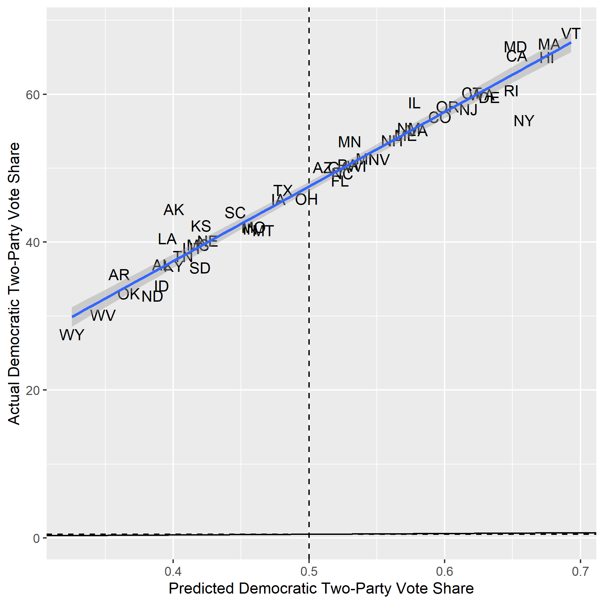

# Evaluation

# November 23, 2020

## Model Recap

To give a brief summary of my model, I used a polls-only binomial logit
regression to find the probability of a single voter voting either for Biden or
Trump, and then using that to run 10,000 election simulations across the likely
voter population (LVP). (After correcting a minor error in my code) I predicted
Biden would win 350 electoral votes to Trump's 188, winning the following states:

### Average Simulated Election: State Results

**This map correctly predicts the winner of 48 states, missing only Florida**
**and North carolina.** Although this is a fairly accurate performance of
predicting a binary variable, it accounts for neither the closeness of each state
election nor the confidence in that outcome.

## Accuracy

To examine this aspect of accuracy, I created a classic scatterplot of actual
Democratic state two-party vote share against predicted Democratic state
two-party vote share. Here are the results:

### Actual Against Average Predicted Democratic State Two-Party Vote Share

**The regression slope is parallel to perfection.** I was amazed and devastated
at once when I first saw this graph. On the one hand, my model uniformly
overestimated Biden's two-party vote share, which is regrettable for accurately
predicting vote shares in battleground states--my RMSE is 3.29, which is in
the same ballpark as the RMSEs of FiveThirtyEight (3.04) and The Economist
(2.83). On the other hand, the trend line is nearly exactly parallel to the
45-degree line, which is the measure of perfect accuracy. If I could somehow
correct for this rightward shift, my predictions would enjoy a marked
improvement.

Another measurement of accuracy I employed is the Brier scoring function. Rather
than measure two-party vote share accuracy, it instead measures *confidence*
accuracy, taking the mean squared error between my forecasted state win
probabilities and the binary value of the actual state result (1 if Biden won,
0 if Biden lost). For example, my model predicted Biden had a 97.7% chance of
winning Vermont, which he did win; my Brier score for Vermont would then be
0.000529. Overall, my model's Brier score is 0.076, which is better than random
chance (0.25), but a far cry from our class average (0.029).

# hypotheses: polls fundamentally ill equipped to handle non-response bias (or just trump), trump appealed to non-responders
# general liberal bias in polls? (exclusion of polls favoring Trump, <- pollster grading, herding)

## Prediction
