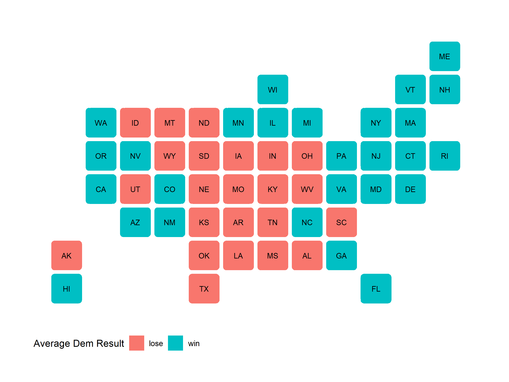

# Evaluation

# November 23, 2020

## Model Recap

To give a brief summary of my model, I used a polls-only binomial logit
regression to find the probability of a single voter voting either for Biden or
Trump, and then using that to run 10,000 election simulations across the likely
voter population (LVP). (After correcting a minor error in my code) I predicted
Biden would win 350 electoral votes to Trump's 188, winning the following states:

### Average Simulated Election: State Results

**This map correctly predicts the winner of 48 states, missing only Florida**
**and North Carolina.** Although this is a fairly accurate performance of
predicting a binary variable, it accounts for neither the closeness of each state
election nor the confidence in that outcome.

## Accuracy

To examine this aspect of accuracy, I created a classic scatterplot of actual
Democratic state two-party vote share against predicted state Democratic
two-party vote share. Here are the results:

### Democratic Two-Party Vote Share by State: Actual Vs. Predicted

**The regression slope is parallel to perfection.** I was amazed and devastated
at once when I first saw this graph. On the one hand, my model uniformly
overestimated Biden's two-party vote share, which is regrettable for accurately
predicting vote shares in battleground states--my RMSE is 3.29, which is in
the same ballpark as the RMSEs of FiveThirtyEight (3.04) and The Economist
(2.83). On the other hand, the trend line is nearly exactly parallel to the
45-degree line, which is the measure of perfect accuracy. If I could somehow
correct for this rightward shift, my predictions would enjoy a marked
improvement.

Another measurement of accuracy I employed is the Brier scoring function. Rather
than measure two-party vote share accuracy, it instead measures *confidence*
accuracy, taking the mean squared error between my forecasted state win
probabilities and the binary value of the actual state result (1 if Biden won,
0 if Biden lost). For example, my model predicted Biden had a 97.7% chance of
winning Vermont, which he did win; my Brier score for Vermont would then be
0.000529. Overall, my model's Brier score is 0.076, which is better than random
chance (0.25), but a far cry from our class average (0.029).

## Hypotheses for Inaccuracies

I have a two main hypotheses for why polling data, the only input my model took,
similarly overestimated Biden's advantage going into the election.

The first hypothesis pertains to partisan or differential non-response bias:
pollsters are fundamentally ill-equipped to handle non-response bias. It may be
that the type of voter who does not pick up the phone or reply to email to
respond to polls and surveys is more likely to vote for Trump, whether by being
conservative (a prevailing theory is that Democrats during the pandemic were
easier to reach for surveys and generally more willing to engage in surveys) or
having traits correlated with the Republican party coalition (rural, non-college
educated). Maybe they were simply unavailable, or maybe they lack trust in
polling institutions enough to actively avoid participating, as is sometimes
asserted.

The second hypothesis pertains to methods of poll aggregation and possible
liberal bias amongst pollsters. The inherent risks of survey methods outlined in
the first hypothesis can be compounded through the practice of pollster grading.
FiveThirtyEight weights their polling models based on a holistic grade given to
each polling institution based on [various factors](https://fivethirtyeight.com/features/how-fivethirtyeight-calculates-pollster-ratings/).
Based on these pollster grades, some polls may be excluded from their models. If
memory serves, I remember Professor Enos mentioning that RealClearPolitics
included surveys other poll aggregators were reluctant to touch--SurveyMonkey
(538 Grade: D-), to name a prominent example--that gave a more accurate picture
of Trump's support going into the election.

Maybe there is widespread liberal bias inside polling organizations leading to
Democratic-leaning "house effects," though I think it is improbable. More
likely, this could indicate a worsening trend of "herding," whereby many
lower-quality polling organizations "herd" around the estimates of a few
reputable polling organizations, hoping to piggyback off their efforts and give
the illusion of accuracy. This phenomenon is detrimental to polling averages and
could be behind the over-exaggeration of Biden's lead.

A third, more fringe hypothesis revolves around a "Trump distortion effect."
This hypothesis posits that Trump is such a galvanizing figure that it affected
all aspects of the political system: cable news, social media, pollsters,
party messaging, general governance, forecasters, and individual voters. He is
like a magnet upon a compass--we cannot blame what has guided us so well for so
long when it is under an influence so baneful to its existence. Trump is thus an
*outlier*, not fit for and indeed disrupting mainstream, finely tuned election
models. Under this hypothesis, our current models may not need to change with
Trump's exit from the political stage.

## Possible Tests for Hypotheses

For the first hypothesis, it is difficult to consider tests to find people who
do not respond to tests. In an ideal world, we would have methods in place to
ensure equal probabilities of contacting any (likely) voter in the country.
However, in reality the only choice seems to be to restore conservative trust in
news media and polling organizations to increase response rates and assess
whether those results would have been substantively different than just
weighting.

For the second hypothesis, I could create three separate models--one based on
pollsters rated B or higher, one based on pollsters rated B- or lower, and one
combined model--and compare their predictions. Alternatively, I could measure
the spread of polls over time to find evidence for herding in general, giving
particular attention to battleground / swing states, and assume from there the
downsides for poll aggregation.

For the third hypothesis, the only test is time. We always want the answers in
the moment, but our politics need time to settle and remove itself from a Trump-
dominated, reality warping landscape. If current polling methods are used in
the 2024, 2028, 2032 elections and return to accuracy, we will have found our
answer.

## If I Had to Do It All Over Again

There is only one thing I would add to my model: Q3 GDP growth. It is common
practice to use Q2 GDP growth based on historical predictive power and easy
availability, but looking back it may have been prudent to represent a
recovering economy using data that was available days before our final
prediction was due (Yao Yu actually posted a Q3 GDP dataset from the BEA on
October 29th on the Slack channel). Including this data would have been a nice
compromise between using conventional economic indicators and utterly abandoning
them, and would have hedged my probabilities for close states like Florida and
North Carolina.

## It's Been Fun

It has been a pleasure to work with such intelligent and involved classmates in
analyzing, predicting, and dissecting this election. I give my thanks to Soubhik
Barari and Professor Ryan Enos for teaching me so much about elections,
modeling, statistics, political science, and critical thinking. This class and
year will be an especial memory for me.

Humbly,

Elias E.Q. DeLeon
