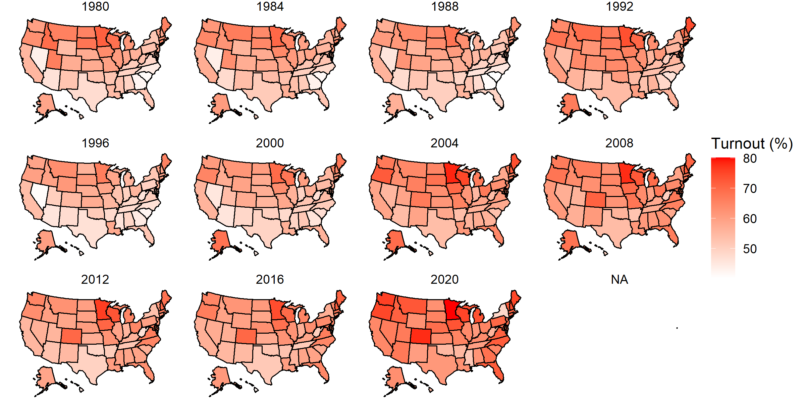
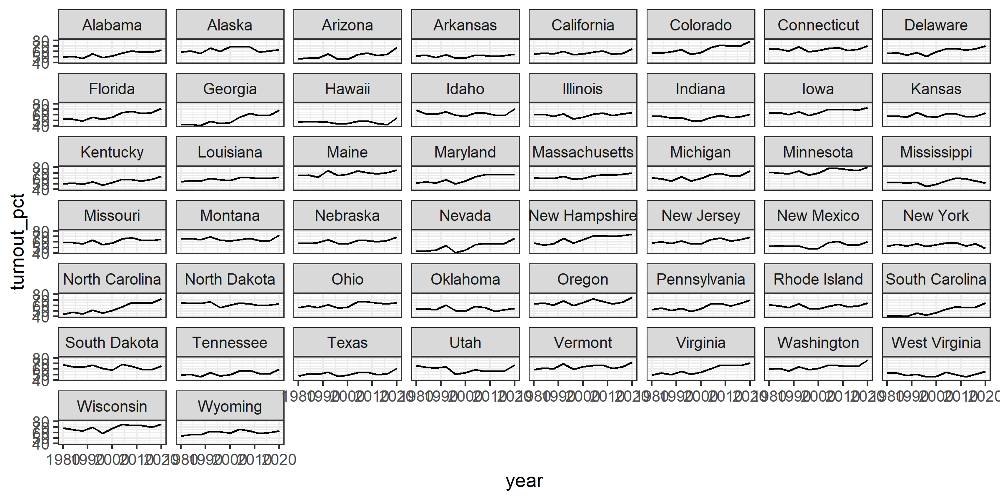
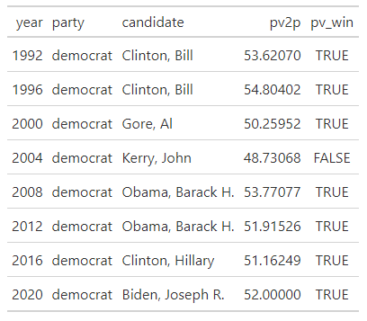
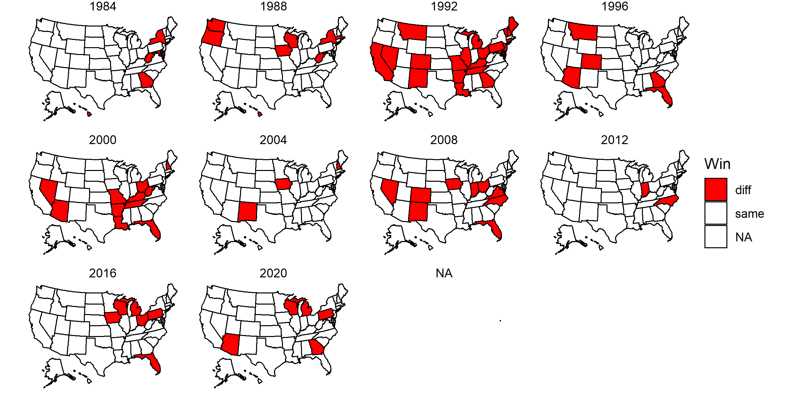
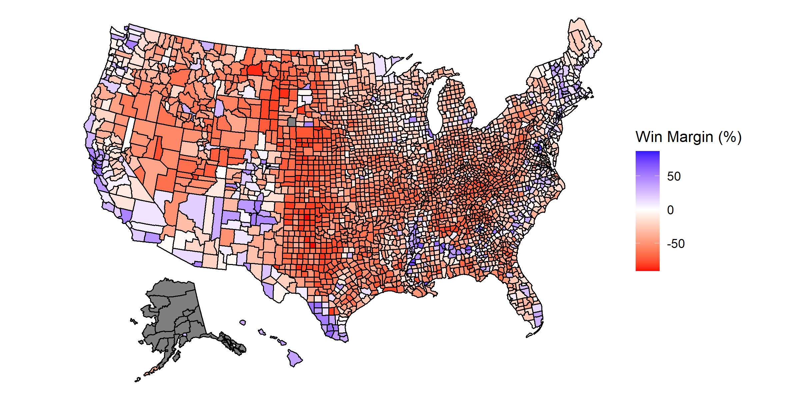
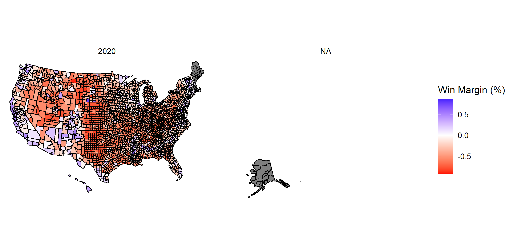
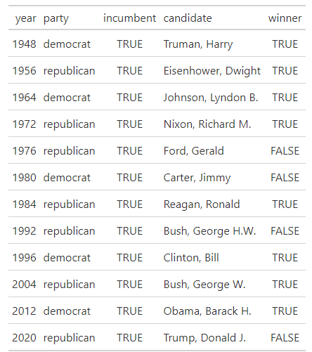

# Historical Trends

# November 23, 2020

## Historical Trends: More of the Same

### Turnout Over Time: U.S. Map

Look how red 2020 is!

### Turnout Over Time: By State

There is a general rise or consistency in turnout percentage for all states, with
2020 representing a large uptick for all states but New York and Mississippi.

### Democrats Win the National Popular Vote...Again...

### States Voting Different Party From Previous Election 1984-2020

### 2016 Presidential Election Results By County

### 2020 Presidential Election Results By County

### 2020 Presidential Election Results By County (Really This Time)

## One Difference

### Fourth *Elected* First-Term Incumbent to Lose in Last Century

