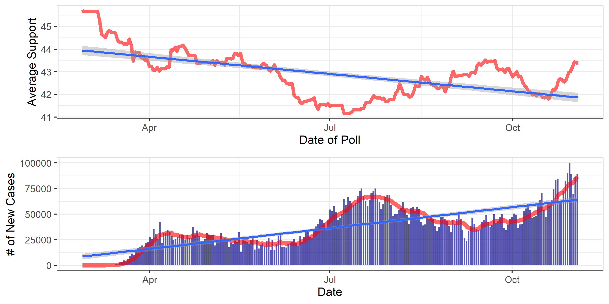

# Media Narratives

# December 10, 2020


## COVID Containment & Economic Recovery


Fundamentals and polls alike got a lot of flack this election cycle. With COVID-19
and economic lockdowns in many parts of the country, forecasters who relied on
Q2 GDP growth for their models were met with an unprecedented 8% *drop*, leading
to unreasonable predictions of 20-30% for Trump's vote share. Poll aggregating
sites told a similar story, with Biden up 5-8% in many key battleground states
like Michigan, Maine, and Pennsylvania.

And then Trump outperformed those polls by around 3% ***across the board***.

I think two main questions arose after Election Day:

1. **Why did Trump outperform the polls?**
2. **Could fundamentals still have had predictive power this election?**

One media narrative can partially answer both: [Fears about the economy under COVID-19 lockdowns helped Trump outperform polls](https://www.theguardian.com/world/2020/nov/04/exit-polls-economy-covid-lockdown-trump). This narrative proposes that voters had become discontented with an intense,
exhaustive pandemic response, and saw Biden as supporting its continuation and
Trump supporting its cessation. This dichotomy between rebuilding the economy
and curbing coronavirus spread, combined with partial economic recovery in the
months preceding the election, may have led people to vote for Trump at
higher rates than predicted.

I think testing this narrative is important because for an election cycle as
tumultuous as this one, with as many predictive red herrings as this one, what
stays the same can be very telling of how people actually vote. To that end, I
have looked at COVID case data, GDP data, poll aggregator data, and exit polling
data to test 2 (presumably) plausible implications of this narrative:

1. If people preferred Trump's policy response to the pandemic, then there should
be a negative correlation between new cases and average support in polls.
2. If the economic recovery played a role in Trump's overperformance, then
including it in a polling regression should increase its accuracy relative to
a polls-only model.


## Testable Implication 1: Trump Support & COVID


### Average Poll Support and Daily New Cases Over Time




We have what visually appears to be a negative correlation: high support in late
February before the brunt of the pandemic, a large spike around early July at the
peak of the pandemic corresponds to Trump's lowest support, which steadily increases
as cases go down before October. However, two points counter this pattern. Firstly,
every correlation I ran between these two datasets yielded no less than -0.12, which
suggests a weak correlation between new cases and polling support. Secondly, the
pattern only holds until October, when a sudden drop and rise in support is only
met with more and more cases. Overall, this visual pattern suggests less than a
preference for Trump than an attribution of a worsening pandemic *to* Trump. Voters
like him more when case go down and vice versa.

That said, it may be that the pattern breaks after the start of the general
election because Trump ran on rebuilding the economy and getting people back to
work, and asserted that Biden was for putting people through another economic
lockdown.


## Testable Implication 2: Accounting for Q3 Economic Recovery


### Multivariable Regression: Average Poll Support & Q2 GDP Growth

```r
Call:
lm(formula = pv2p ~ avg_support + GDP_growth_qt, data = mlk)

Residuals:
    Min      1Q  Median      3Q     Max 
-4.6234 -0.7780  0.1082  0.6658  3.2407 

Coefficients:
              Estimate Std. Error t value Pr(>|t|)   
(Intercept)    23.6527     6.1685   3.834  0.00329 **
avg_support     0.5873     0.1428   4.114  0.00210 **
GDP_growth_qt   1.6237     0.7312   2.221  0.05064 . 
---
Signif. codes:  0 ‘***’ 0.001 ‘**’ 0.01 ‘*’ 0.05 ‘.’ 0.1 ‘ ’ 1

Residual standard error: 2.474 on 10 degrees of freedom
Multiple R-squared:  0.7897,	Adjusted R-squared:  0.7476 
F-statistic: 18.77 on 2 and 10 DF,  p-value: 0.0004115
```


Rather than use simply Q2 or Q3 GDP growth, which taken separately suggest wild
margins for Trump, I took the average of the two growth rates, and found that
it fit the final two-party vote share within 0.01% (fit: 47.715%). I believe this
supports the narrative of the economy helping Trump outperform the polls on Election
Day.


## Articles Supporting Narrative

- [Forbes: Why Did Trump Outperform the Polls? The Economy](https://www.forbes.com/sites/advisor/2020/11/04/trump-economy-polls/?sh=5ccb29007fb5)
- [New York Times: The Polls Underestimated Trump — Again. Nobody Agrees on Why.](https://www.nytimes.com/2020/11/04/us/politics/poll-results.html)
- [The Guardian: Fears about economy under Covid lockdown helped Trump outperform polls](https://www.theguardian.com/world/2020/nov/04/exit-polls-economy-covid-lockdown-trump)


## Data Citation

Thank you Yao, one final time, for providing an economics dataset including Q3
data.
